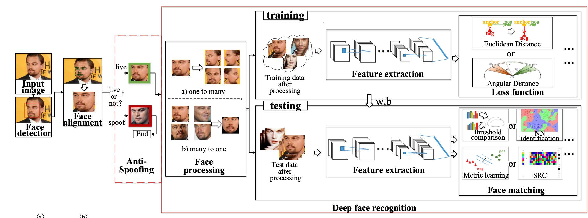

# Masked Face Recognition with Anti Spoofing
> 遮盖状态下的活体人脸身份识别项目，是结合`**人脸检测*`、`**活体检测**`以及`**遮挡状态下的人脸特征提取**`的多流程的综合项目，具体步骤细分为：视频-抽帧-人脸检测-人脸关键点对齐-活体检测-人脸比对-人脸识别。具体每个子项目的细节可以查看文件夹`face anti spoofing`和`masked face recognition`。

</img>

### Dependencies
- torch==1.9.0
- torchvision==0.10.0
- numpy==1.19.5
- pandas==1.3.4

### Models
- 分别从`face anti spoofing`和`masked face recognition`导入预训练模型：活体检测模型，遮挡状态下的人脸特征提取模型
- 结合dlib的人脸检测模型和人脸关键点提取模型，搭建实时的遮挡状态活体人脸身份识别的模型
- 鉴于dlib在检测戴口罩人脸时，会出现找不到人脸的状态，可以考虑重新训练一个对戴口罩人脸更robust的人脸检测模型替代

### Face Database
person_not_exist：https://thispersondoesnotexist.com
可以下载一些不存在的人，通过调用模型得到每个人的embedding，从而从图片/视频/摄像头3种方式搭建虚拟的员工人脸数据库。

通过GUI窗口选择静态图片的单人/多人路径，再通过每个员工10张静态图片提取平均emb：  
</img>
</img>

或者通过截取10张动态视频/摄像头截图提取平均emb，留意窗口上方的文字：
- Please hold on for us to recognize your face. 此时模型在识别当中
- Recognition finished! Please press "q" to quit :) 模型提取emb完毕，可随时按q退出页面

</img>
</img>

### Prediction
进行活体人脸识别，当识别为非活体时，用红框表示；当识别为非数据库上的人，或者非特定刷卡人时，用红框表示；活体且符合要求的用绿框表示，同时输出相似度和活体概率：
- N vs N：遍历数据库匹配
- 1 vs N：通过比对提供的刷卡人身份，判断是否为同一个人
</img>
</img>

