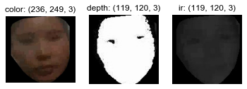
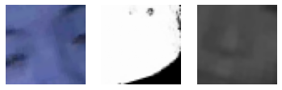
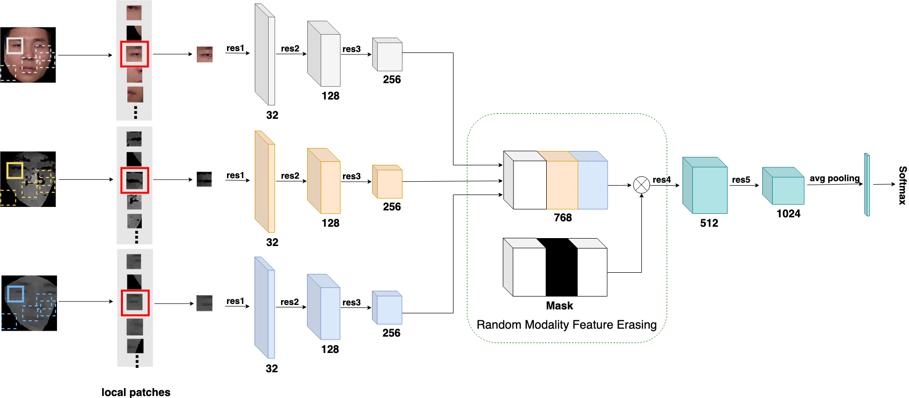
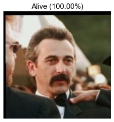
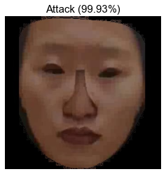

# Multi-Modal Face Anti Spoofing
> 该项目是基于多模态数据的`**活体检测模型**`，主要通过ResNeXt融合SE模块学习人脸细节图像块，让模型集中筛选活体和非活体的细微特征。由于想要把训练好的模型用于`**遮挡状态下的活体人脸身份识别项目**`，需要使用视频截取的RGB图片作为输入，因此着重对单模态模型进行训练，但是为了使`**活体检测模型**`能更灵活地适用于不同场景，在创建数据集和构建模型的时候仍把多模态考虑在内，方面后续随时可以按不同项目的具体情况需求进行调用。

项目过程中的主要困难点、亮点和相关方案：
- 模型结构：设计组合backbone、SE-block和fusion block的不同搭配
- 消融实验：对比了单模态/多模态等多种模型结构，以及在不同学习率和lr scheduler设置下的训练结果
- 模型加速：V100 GPU提速，以及相关tricks的调参
- 模型checkpoints训练日志：通过同步保存optimizer和scheduler状态，根据日志信息，基于上一个保存的最优模型继续训练，最大限度抑制再训练可能导致的反弹情况，逐步迭代最小化ACER
- 模型压缩：由于模型结构较复杂，裁剪filter后容易出现问题，仍待进一步研究更好的压缩方式，如混合精度等
- 项目文件的导入路径问题：使用sys.path更新项目环境路径
- 项目整合：整合项目所有文件和参数配置，方便在终端通过命令或执行脚本指定参数，从而开启自定义训练
- 模型部署：整合预训练模型，并通过class实例化调用

更多训练细节，请查看`face_anti_spoofing.ipynb`。


### Dependencies
- imgaug==0.4.0
- torch==1.9.0
- torchvision==0.10.0
- numpy==1.19.5
- pandas==1.3.4


### Dataset
CASIA_SURF数据集下载: https://aistudio.baidu.com/aistudio/datasetdetail/68721

</img>
</img>


### Single/Multi Modal Models
ResNet18 (resnet18.py) 和SENet系列模型 (senet.py) 可以用做：
- 单模态的模型，直接判断活体
- 多模态模型的backbone，仅用做提取单模态的特征，后续再进行特征融合，从而判断活体

FaceBagNet模型 (facebagnet.py) 根据不同backbone，和特征融合模块，有不一样的组合：
- ResNet18 + 拼接多模态 + Basic Block
- SENet系列 + SE Module + SE-ResNeXt
- ResNet/SENet系列 + SE Module + Basic Block

</img>

通过get_model得到不同模型进行训练，然后进行对比实验：
```
python main.py --model=ResNet18 --modality=color  --patch_size=48 --epoch_inter=10 --cycle_num=1 --initial_lr=0.001 --attention=True --bottleneck=True
```


### Evaluation
单模态模型：用Cosine退火从lr=0.1-0.001训练20个epochs，再用Expo lr从lr=0.001开始训练10个epochs：

| Single-modal Model    |  ACER  |   ACC  |  Loss  | AUC   |
| --------------------- | ------ | ------ | ------ | ----  |
| ResNet18              | 0.0448 | 0.9552 | 0.1359 | 0.9805|
| SE-ResNet             | 0.0837 | 0.9163 | 0.1962 | 0.9802| 
| SE-ResNeXt18          | 0.0521 | 0.9480 | 0.1636 |
| SE-ResNeXt50          | 0.0599 | 0.9405 | 0.1540 |

Training Log Demo:

```
Training log @ running_log/FaceBagNet_ResNet18_color_48
Device: cpu

** Dataset setting **
training_samples = 29266
val_samples = 9608
batch_size = 128
modality = color
patch_size = 48

** Model setting **
Model: ResNet18

** Training setting **
criterion = cross_entropy
optimizer = SGD
scheduler = CosineAnnealingLR_with_Restart
cycle_num = 1
epochs_per_cycle = 20

** Start training here! **
                  |---- TRAIN -----|-------- VALID ---------|
cycle epoch   lr  |  loss    acc   |  loss    acer    acc   |    time    
-------------------------------------------------------------------------
  1     1   0.0994| 0.8382  0.6815 | 0.0000  0.0000  0.0000 |00h 16m 12s 
  1     2   0.0976| 0.4684  0.7686 | 0.0000  0.0000  0.0000 |00h 30m 59s 
  1     3   0.0946| 0.4145  0.8066 | 0.0000  0.0000  0.0000 |00h 45m 21s 
  1     4   0.0905| 0.3521  0.8429 | 0.0000  0.0000  0.0000 |01h 00m 21s 
  1     5   0.0855| 0.3474  0.8444 | 0.0000  0.0000  0.0000 |01h 15m 23s 
  1     6   0.0796| 0.3385  0.8467 | 0.0000  0.0000  0.0000 |01h 30m 01s 
  1     7   0.0730| 0.3257  0.8571 | 0.0000  0.0000  0.0000 |01h 45m 06s 
  1     8   0.0658| 0.3196  0.8606 | 0.0000  0.0000  0.0000 |01h 59m 34s 
  1     9   0.0582| 0.3021  0.8672 | 0.0000  0.0000  0.0000 |02h 15m 26s 
  1     10  0.0505| 0.2955  0.8715 | 0.0000  0.0000  0.0000 |02h 31m 21s 
  1     11  0.0428| 0.2799  0.8808 |158.7322 0.4957  0.5031 |03h 27m 08s 
Saving cycle 1 min acer model: 0.4957
Saving global min acer model: 0.4957
  1     12  0.0352| 0.2563  0.8917 |71.3999  0.3057  0.6994 |04h 33m 42s 
Saving cycle 1 min acer model: 0.3057
Saving global min acer model: 0.3057
  1     13  0.0280| 0.2447  0.8970 |60.3091  0.2537  0.7453 |05h 48m 25s 
Saving cycle 1 min acer model: 0.2537
Saving global min acer model: 0.2537
  1     14  0.0214| 0.2310  0.9043 |50.3150  0.1898  0.8126 |07h 03m 03s 
Saving cycle 1 min acer model: 0.1898
Saving global min acer model: 0.1898
  1     15  0.0155| 0.2094  0.9120 |65.2712  0.2450  0.7516 |08h 17m 29s 
  1     16  0.0105| 0.1855  0.9250 |53.1389  0.2079  0.7917 |09h 32m 17s 
  1     17  0.0064| 0.1691  0.9316 |34.6931  0.1129  0.8861 |10h 47m 15s 
Saving cycle 1 min acer model: 0.1129
Saving global min acer model: 0.1129
  1     18  0.0034| 0.1485  0.9402 |23.3116  0.0532  0.9464 |12h 02m 08s 
Saving cycle 1 min acer model: 0.0532
Saving global min acer model: 0.0532
  1     19  0.0016| 0.1322  0.9469 |27.7616  0.0811  0.9188 |13h 08m 02s 
  1     20  0.0010| 0.1249  0.9516 |17.9580  0.0474  0.9524 |14h 20m 37s 
Saving cycle 1 min acer model: 0.0474
Saving global min acer model: 0.0474
Saving cycle 1 final model: 0.0474
```


### Prediction
```
python train.py --mode=infer_test --model=ResNet18 --modality=color --patch_size=48 --attention=True --bottleneck=True --pretrained_model=global_min_acer_model.pth
```
</img>
</img>


### Citation
Please cite the following papers in your publications if it helps your research:
```
@InProceedings{Shen_2019_CVPR_Workshops,
author = {Shen, Tao and Huang, Yuyu and Tong, Zhijun},
   title = {FaceBagNet: Bag-Of-Local-Features Model for Multi-Modal Face Anti-Spoofing},
booktitle = {The IEEE Conference on Computer Vision and Pattern Recognition (CVPR) Workshops},
month = {June},
year = {2019}
}

@InProceedings{Zhang_2019_CVPR,
author = {Zhang, Shifeng and Wang, Xiaobo and Liu, Ajian and Zhao, Chenxu and Wan, Jun and Escalera, Sergio and Shi, Hailin and Wang, Zezheng and Li, Stan Z.},
title = {A Dataset and Benchmark for Large-Scale Multi-Modal Face Anti-Spoofing},
booktitle = {Proceedings of the IEEE/CVF Conference on Computer Vision and Pattern Recognition (CVPR)},
month = {June},
year = {2019}
}

@article{zhang2020casia,
title={Casia-surf: A large-scale multi-modal benchmark for face anti-spoofing},
author={Zhang, Shifeng and Liu, Ajian and Wan, Jun and Liang, Yanyan and Guo, Guodong and Escalera, Sergio and Escalante, Hugo Jair and Li, Stan Z},
journal={IEEE Transactions on Biometrics, Behavior, and Identity Science},
volume={2},
number={2},
pages={182--193},
year={2020},
publisher={IEEE}
}

[1] Shifeng Zhang, Xiaobo Wang, Ajian Liu, Chenxu Zhao, Jun Wan*, Sergio Escalera, Hailin Shi, Zezheng Wang, Stan Z. Li, " A Dataset and Benchmark for Large-scale Multi-modal Face Anti-spoofing ", CVPR, 2019. (conference version of the CASIA-SURF dataset)
[2] Shifeng Zhang, Ajian Liu, Jun Wan*, Yanyan Liang, Guodong Guo, Sergio Escalera, Hugo Jair Escalante and Stan Z. Li, "CASIA-SURF: A Large-scale Multi-modal Benchmark for Face Anti-spoofing", IEEE Transactions on Biometrics, Behavior, and Identity Science (TBIOM), 2020. (Journal version of the CASIA-SURF dataset)
[3] Ajian Liu, Jun Wan*, Sergio Escalera, Hugo Jair Escalante, Zichang Tan, Qi Yuan, Kai Wang, Chi Lin, Guodong Guo, Isabelle Guyon, Stan Z. Li, "Multi-modal Face Anti-spoofing Attack Detection Challenge at CVPR2019", CVPR workshop, 2019. (Results of face anti-spoofing Challenges based on CASIA-SURF at CVPR2019)
[4] Jun Wan, Guodong Guo, Sergio Escalera, Hugo Jair Escalante, Stan Z. Li* (Editors), Multi-Modal Face Presentation Attack Detection, Synthesis Lectures on Computer Vision, Morgan & Claypool Publishers, 2020.
[5] Ajian Liu, Zichang Tan, Jun Wan*, Sergio Escalera, Guodong Guo, Stan Z. Li, "CASIA-SURF CeFA: A Benchmark for Multi-modal Cross-ethnicity Face Anti-spoofing", WACV, 2021. (Release the CASIA-SURF CeFA Dataset)
[6] Ajian Liu, Xuan Li, Jun Wan*, Yanyan Liang, Sergio Escalera, Hugo Jair Escalante, Meysam Madadi, Yi Jin, Zhuoyuan Wu, Xiaogang Yu, Zichang Tan, Qi Yuan, Ruikun Yang, Benjia Zhou, Guodong Guo, Stan Z. Li,, "Cross-ethnicity Face Anti-spoofing Recognition Challenge: A Review", IET Biometrics, 2020 (Results of face anti-spoofing Challenges based on CASIA-SURF CeFA at CVPR2019)
```


