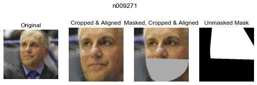
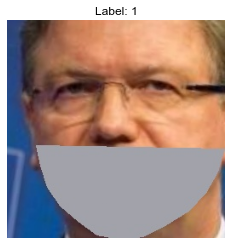
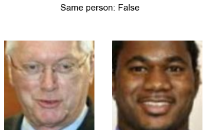
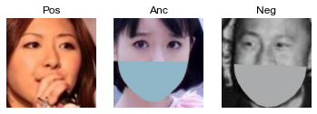
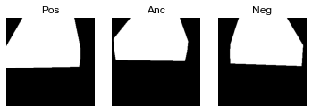
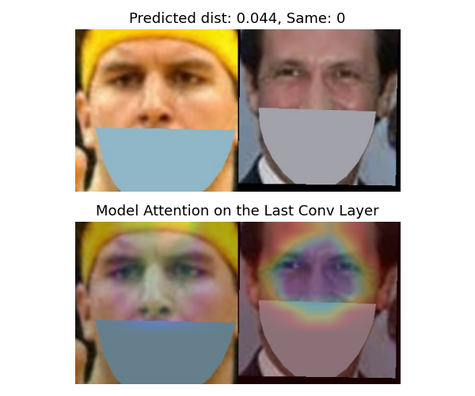
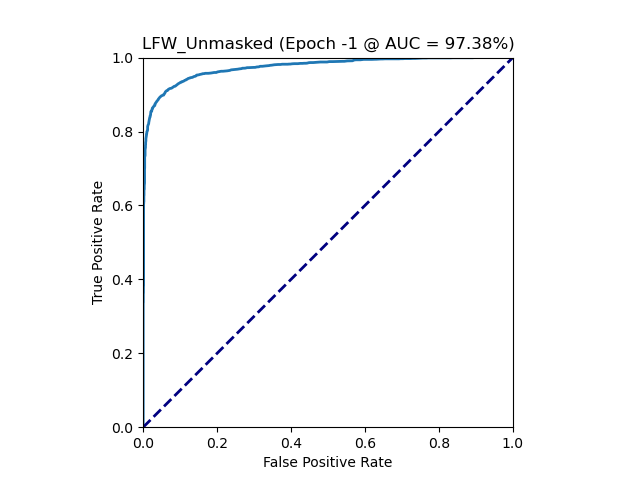
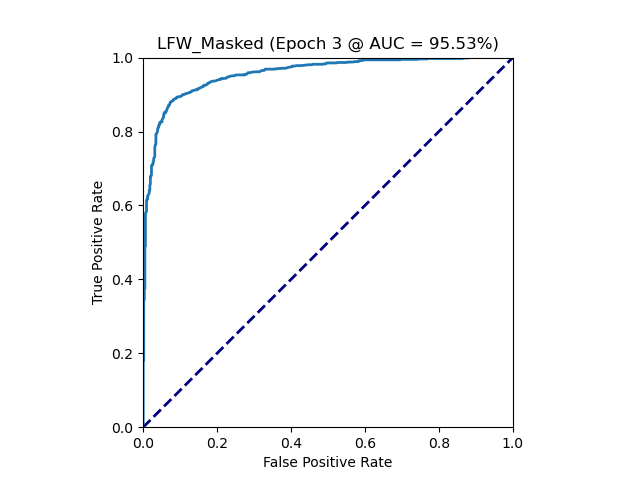
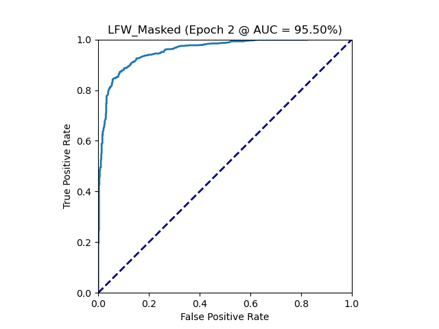

## Masked Face Recognition
> 作为 `**遮挡状态下的活体人脸身份识别项目**`的其中一个环节，遮挡状态下的人脸特征提取模型，主要通过CBAM模块结合预训练ResNet50，让模型集中在不被口罩遮挡部分的人脸特征，提高识别率。借鉴VGGFace的训练方式，先利用ArcFace softmax loss对模型进行分类训练，后续再通过Triplet和attention loss对模型进行fine tuning。

项目过程中的主要困难点、亮点和相关方案：
- 数据处理：需要根据现有数据集，创建戴口罩的数据用于训练和验证
- 模型结构：设计组合骨干模型、CBAM block的不同搭配
- 消融实验：对比了在不同模型结构、训练数据的搭配、embbedding dim，以及不同loss的训练方式等设置下的AUC、ACC等
- 模型加速：GPU提速，以及相关tricks的调参
- 模型checkpoints训练日志：通过同步保存optimizer和scheduler状态，根据日志信息，基于上一个保存的最优模型继续训练，最大限度抑制再训练可能导致的反弹情况，逐步迭代最大化AUC
- 项目文件的导入路径问题：使用sys.path更新项目环境路径
- 项目整合：整合项目所有文件和参数配置，方便在终端通过命令或执行脚本指定参数，从而开启自定义训练
- 模型部署：整合预训练模型，并通过class实例化调用
更多训练细节，请查看`masked_face_recognition.ipynb`。


### Dependencies
- torch==1.9.0
- torchvision==0.10.0
- numpy==1.19.5
- pandas==1.3.4


### Dataset
- VGGFace2：链接：http://www.robots.ox.ac.uk/~vgg/data/vgg_face2/ 下载：https://aistudio.baidu.com/aistudio/datasetdetail/13135)
- LFW(Labeled Faces in the Wild)：链接：http://vis-www.cs.umass.edu/lfw/<br>
- Masked dataset：借助cv2，基于VGGFace2和LFW创建戴口罩数据如下，VGGFace2总耗时5个小时，会需要预留一定时间来创建新数据集，并保证电脑有足够的空间.    
</img>

首先，我们需要明确Training/Validation/Test set的分布，确保我们的训练方向与实际应用相符。

实际应用场景中，员工的照片通常为不戴口罩版本，而实际需要识别的情景包括戴和不戴口罩两种，Training和Test set的分布不一致，导致错误率变大。为避免模型根据不戴口罩照片(全脸特征)得到的emb可能难以识别戴口罩后的同一个人(只剩下上半脸特征)，我们需要训练一个模型使其能仅通过上半部分脸就作出判断。

参考VGGFace训练方式，我们先通过**ArcFace版的Softmax**进行多分类训练，让模型学会通过上半脸特征，最大化不同人之间的差距，关于训练集的组成有以下想法：
- 只用不戴口罩照片
- 只用戴口罩照片：更偏向这种，迫使模型集中于上半脸
- 混合戴口罩和不戴口罩照片

然后再通过**Triplet loss**最小化同一人的差异，最大化不同人的差异，可尝试配合**Attention loss**辅助模型在训练期间把注意力集中到上半脸。关于Triplets的组合，为了增加AP和AN难度，有以下想法：
- masked (A + P + N)：正常搭配，进一步拉开masked AN差距，用masked LFW进行验证
- masked A + unmasked P + unmasked N：虽然模型可能已经把重点关注在上半脸，但是当下半脸露出时，和原本大片色块的口罩差距变大，也可能会导致混乱使难度变大，使AP、AN差距都变大，用unmasked LFW进行验证
- masked A + unmasked P + masked N：当AN都戴口罩时差距变小，相反AP差距变大，为了使AP差距比AN更小，再进一步促进模型学习
- 同理A用unmasked，然后其他搭配相反

创建三种类型的数据集：单张照片、二元组、三元组，满足不戴口罩、戴口罩、不带口罩区域mask以及mask的bbox文件等多种需求：   
</img>
</img>  
</img>
</img>


### Models
- 不带attention模块的resnet系列：根据不同的softmax loss和triplet loss训练方式，模型结构稍有不同
- 带CBAM模块的resnet系列：根据是否用CBAM模块，还是只在blocks中间加入Spatial attention模块，以及不同的训练loss，模型结构都稍有不同

通过run.sh自定义在不同loss下，不同模型和输入的训练，然后进行对比实验：
```
python main_softmax.py --model=resnet50 --epochs=50 --masked_face=True --attention=True --cbam=True
python main_triplet.py --model=resnet50 --epochs=50 --masked_face=True --attention=True --cbam=True
python main_triplet_att.py --model=resnet50 --epochs=50 --masked_face=True --cbam=True
```
对于带spatial attention模块的模型，可以在训练过程中提取模型最后一层得到的attention map并进行可视化，从而看到模型在学习过程中把重点放在哪些地方，是否有与未遮挡的脸部区域部分逐渐靠近：   
></img>


### Evaluation
主要围绕几种常见情形，看哪种训练组合能够得到预测率高的模型：
- 用不/戴口罩的数据，不/配合mask训练，预测不/戴口罩的照片
- 用不/带attention结构的模型，不/配合attention loss训练
- 先用Softmax训练，再用Triplet loss微调/直接只用Triplet loss训练

\* *AUC后的括号表示best dist threshold*
100%|

| 骨干 | Emb | CBAM | Spatial Att  | Att Loss | Softmax Loss | Triplet Loss | 戴口罩VGG | Mask图/矩形框 | AUC (戴口罩LFW) | AUC (不戴口罩LFW) |
| -- | -- | -- | -- | -- | -- | -- | -- | -- | -- | -- |
| Resnet50 |128| ✔ | ✔ |   | ✔ |  |   |      | 0.877 (1.073) | 0.974 (1.269) |
| Resnet50 |128| ✔ | ✔ |   | ✔ |  | ✔ |      | 0.955 (1.277) | 0.965 (1.261)|


验证的时候检查模型的roc curve：   


也可以制作成gif方便形象对比：   
</img>

Training log demo:
```
Training log @ running_log/resnet50_att_cbam_masked_128
Device: cuda

** Dataset setting **
Dataset: VGGFace2 Masked Faces
training_samples = 113843
val_samples = 28461
batch_size = 32

** Model setting **
Model: ResNet_CBAM
pretrained: True

** Training setting **
criterion = arcface softmax loss (scale=30)
optimizer = Adam
epochs = 5

** Start training here! **
            |-- TRAIN ---|-------------- VALID ---------------|
epoch   lr  | loss  acc  |  loss      acc   precision recall  |    time    
------------------------------------------------------------------------
  1   1e-04 |15.3200.398 |  5.689    0.712    0.728    0.657  |00h 14m 59s 
Saving epoch 1 max acc model: 0.7122
  2   1e-04 |6.377 0.823 |  5.552    0.832    0.839    0.800  |00h 29m 57s 
Saving epoch 2 max acc model: 0.8319
  3   1e-05 | 2.579  0.936 |  5.470    0.894    0.880    0.871  |00h 15m 09s 
Saving epoch 3 max acc model: 0.8949
Validation - dist_thres: 1.246(+-0.004) - auc: 0.965 - acc: 0.911(+-0.001) - recall: 0.873(+-0.014) - tar@far=1e-3: 0.564(+-0.032)
Validation - dist_thres: 1.290(+-0.001) - auc: 0.952 - acc: 0.890(+-0.002) - recall: 0.883(+-0.027) - tar@far=1e-3: 0.106(+-0.030)
  4   1e-05 | 1.730  0.962 |  5.464    0.901    0.888    0.881  |00h 15m 15s 
Saving epoch 4 max acc model: 0.9011
Validation - dist_thres: 1.261(+-0.002) - auc: 0.961 - acc: 0.907(+-0.001) - recall: 0.873(+-0.015) - tar@far=1e-3: 0.479(+-0.036)
Validation - dist_thres: 1.308(+-0.010) - auc: 0.951 - acc: 0.889(+-0.002) - recall: 0.897(+-0.038) - tar@far=1e-3: 0.130(+-0.041)
  5   1e-06 | 1.153  0.977 |  5.460    0.904    0.890    0.884  |00h 37m 59s 
Saving epoch 5 max acc model: 0.9037
Validation - dist_thres: 1.275(+-0.002) - auc: 0.959 - acc: 0.903(+-0.001) - recall: 0.879(+-0.015) - tar@far=1e-2: 0.706(+-0.018)
Validation - dist_thres: 1.305(+-0.001) - auc: 0.948 - acc: 0.888(+-0.002) - recall: 0.882(+-0.032) - tar@far=1e-2: 0.591(+-0.066)
```


### Prediction
```
python main_triplet.py --mode=infer_test --model=resnet50 --attention=True --cbam=True --pretrained_model=global_max_auc_model.pth
```

#### Citation
```
@InProceedings{Huang2007a,
  author =    {Gary B. Huang and Vidit Jain and Erik Learned-Miller},
  title =     {Unsupervised Joint Alignment of Complex Images},
  booktitle = {ICCV},
  year =      {2007}
}
```
